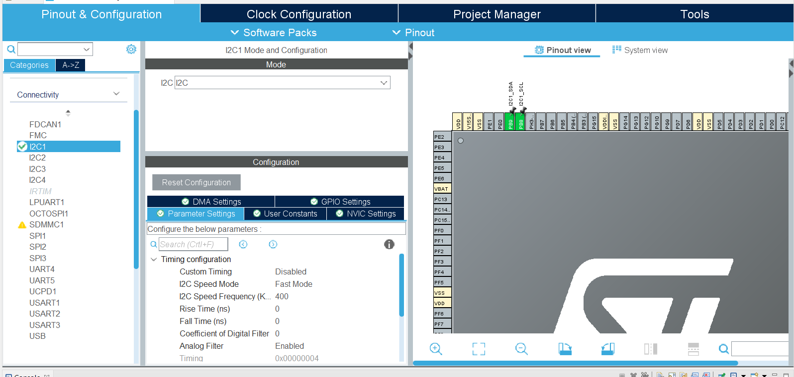

# Test 1

**Board** : NUCLEO-L552ZE-Q

**EEPROM** : U1 (**I2C**)


# Steps:

In the `.ioc` file:
- Enable **SCL** on **PB8**
- Enable **SDA**  on **PB9**
- Enable **I2C** in **fast mode** to set the speed at 400 kHz.



Modify these lines in the `drv-eeprom.c` :

```C
HAL_I2C_Mem_Read(instance->handler, instance->dev_addr, address, X, buffer, size, 25);
HAL_I2C_Mem_Write(instance->handler, instance->dev_addr, address, X, buffer, size, 25); 
X = 1
```
