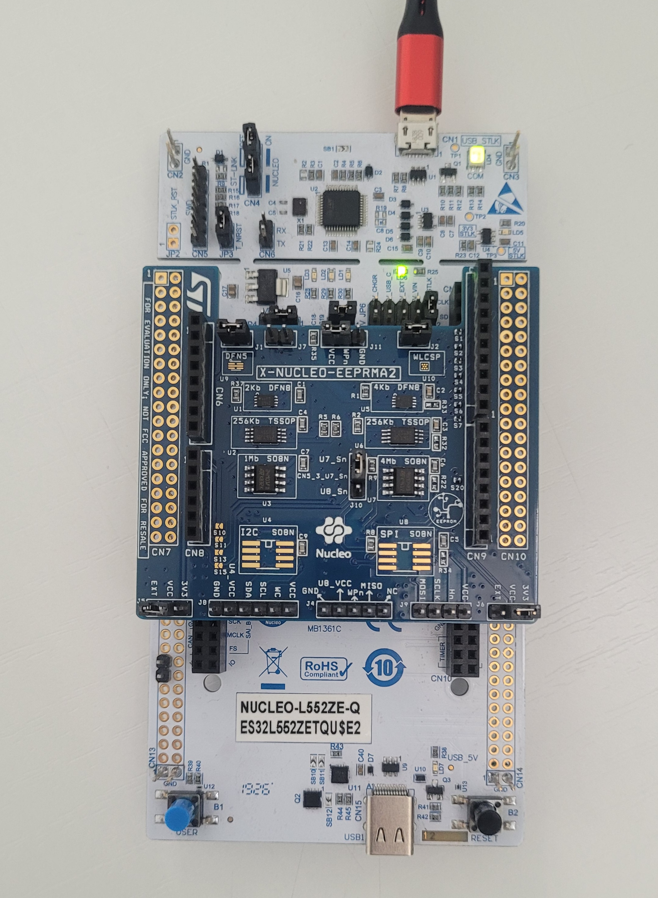

# Test Driver EEPROM recap

# Tests list:

- [Test code](https://github.com/energicamotor/stm32-drv-eeprom/blob/main/.tests/drv_eeprom.c.ut)
 
|**#**|**Microcontroller**|**EEPROM**|**Test file**|
|:---:|:---:              |:---:     |     :---:   |
|**1**|NUCLEO-**L5**52ZE-Q|U1|[EEPROM_Test_1.md](https://github.com/energicamotor/stm32-drv-eeprom/blob/main/.info/EEPROM_Test_1.md)|
|**2**|NUCLEO-**L5**52ZE-Q|U2|[EEPROM_Test_2.md](https://github.com/energicamotor/stm32-drv-eeprom/blob/main/.info/EEPROM_Test_2.md)|
|**3**|NUCLEO-**L5**52ZE-Q|U3|[EEPROM_Test_3.md](https://github.com/energicamotor/stm32-drv-eeprom/blob/main/.info/EEPROM_Test_3.md)|
|**4**|NUCLEO-**H7**45ZI-Q|U1|[EEPROM_Test_4.md](https://github.com/energicamotor/stm32-drv-eeprom/blob/main/.info/EEPROM_Test_4.md)|
|**5**|NUCLEO-**H7**45ZI-Q|U2|[EEPROM_Test_5.md](https://github.com/energicamotor/stm32-drv-eeprom/blob/main/.info/EEPROM_Test_5.md)|
|**6**|NUCLEO-**H7**45ZI-Q|U3|[EEPROM_Test_6.md](https://github.com/energicamotor/stm32-drv-eeprom/blob/main/.info/EEPROM_Test_6.md)|
|**7**|NUCLEO-**U5**75ZI-Q|U1|[EEPROM_Test_7.md](https://github.com/energicamotor/stm32-drv-eeprom/blob/main/.info/EEPROM_Test_7.md)|
|**8**|NUCLEO-**U5**75ZI-Q|U2|[EEPROM_Test_8.md](https://github.com/energicamotor/stm32-drv-eeprom/blob/main/.info/EEPROM_Test_8.md)|
|**9**|NUCLEO-**U5**75ZI-Q|U3|[EEPROM_Test_9.md](https://github.com/energicamotor/stm32-drv-eeprom/blob/main/.info/EEPROM_Test_9.md)|

# Test description
## Setup
## Required hardware
- NUCLEO-H745ZI-Q
- NUCLEO-U575ZI-Q
- NUCLEO-L552ZE-Q
- X-NUCLEO-EEPRAM2 (board extension)
- USB to Micro-USB Cable
   

## Required software
- STM32CubeIDE (version 1.7.0)
- [stm32-drv-eeprom](https://github.com/energicamotor/stm32-drv-eeprom)
    
# Steps

  
Connect the expansion board X-NUCLEO-EEPRAM2 to the base NUCLEO stm32 as indicated in the [user manual](https://www.st.com/resource/en/user_manual/um2665-getting-started-with-the-xnucleoeeprma2-standard-ic-and-spi-eeprom-memory-expansion-board-based-on-m24xx-and-m95xx-series-for-stm32-nucleo-stmicroelectronics.pdf) and do as follow:

 1. Check if the jumper on J1 and J2 connectors is connected. These jumpers provide the required voltage to the devices.
 2. Ensure jumper on J11 is put between VCC and WPn.
 3. Ensure jumper on J10 is put between U7_Sn and CN5_3_U7_Sn.
 4. Connect the X-NUCLEO-EEPRMA2 to the STM32 Nucleo board as shown in Figure 2.
 5. Power the STM32 Nucleo development board using the Mini-B USB cable.
 6. Program the firmware in the development board.
 7. Reset the MCU board using the reset button on the STM32 Nucleo development board.

